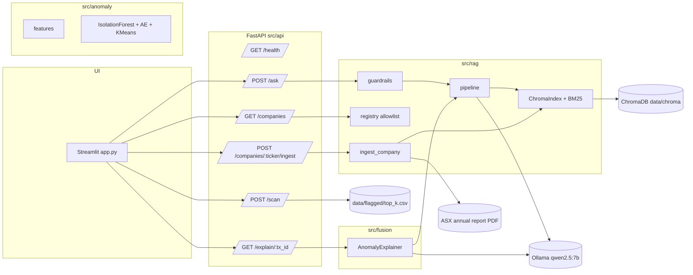

# AuditCopilot

> Local-first, open-source AI assistant for Audit and Assurance. Hybrid RAG over Australian auditing standards (**AUASB ASA**, with IAASB ISA as international reference) and a curated allowlist of eight ASX 50 annual reports, fused with a journal-entry anomaly-detection engine that explains each flagged transaction with cited audit-standard references.

**Status:** Phase 5 — end-to-end demo live (RAG `/ask`, anomaly `/scan`, fusion `/explain`, multi-company `/companies/{ticker}/ingest`, Streamlit UI). See [PLAN.md](PLAN.md) for the full roadmap and [docs/adr/](docs/adr/) for design decisions.

## The problem

An external auditor evaluating fraud risk under **ASA 240** has to do two things in parallel: stay current with auditing-standard guidance (what *procedures* the standard expects given a given risk indicator) and triage the population of journal entries (which *transactions* warrant a closer look). Each task is well-served by existing tools individually — standards search, statistical anomaly tools — but the bridge between them is the auditor's head. AuditCopilot builds that bridge: anomalies flagged by the statistical layer come back with a grounded, cited explanation of *why the standard treats this pattern as a fraud-risk indicator*.

## What it does

### 1. Ask the auditor assistant (`POST /ask`)

Grounded Q&A over two corpora, optionally scoped to one company:

- **AUASB ASA standards** (always loaded) — the Australian auditing standards corpus.
- **One ASX annual report** of the user's choice from an 8-ticker allowlist (`WOW`, `CBA`, `TLS`, `CSL`, `NAB`, `ANZ`, `RIO`, `MQG`). `WOW` ships pre-indexed; the others are fetched, chunked, embedded, and upserted into ChromaDB on demand the first time they are selected.

Retrieval is hybrid: dense embeddings (`all-MiniLM-L6-v2` via ChromaDB) and lexical BM25 (`rank_bm25`) are fused with reciprocal-rank fusion (k=60) and filtered to `{AUASB} ∪ {ASX-<selected ticker>}`. Generation goes through a locked system prompt; output is parsed into a structured `{answer, citations[], refused, reason}` body. Citations carry `source`, `section`, `page`, and `chunk_id`. **Refuses when the top fused retrieval score is below `RAG_MIN_SCORE`** rather than hallucinating.

### 2. Scan journal entries (`POST /scan`)

A 50,000-row synthetic general ledger (`scripts/gen_journal_entries.py`, seed 42) carries known fraud patterns: round-amount postings to revenue, after-hours and weekend activity, unusual user/account pairs, near-duplicates, and Benford first-digit violations. Three detectors score every row:

- **`IsolationForest`** — sklearn baseline.
- **PyTorch autoencoder** — reconstruction error on a 3-layer MLP.
- **`KMeans`** — cluster ID surfaces as a feature for the explainer.

Rank-normalised scores are combined with calibrated weights (`iso=0.25 / ae=1.0 / kmeans=0.0`). The endpoint returns the top-N rows enriched with **16 audit-toned feature flags** — single-row signals (`is_round_amount`, `is_weekend`, `is_after_hours`, `is_large_amount`, `is_sensitive_account`, `is_benford_first_digit_9`, `is_round_credit_to_revenue`, ...) plus cross-row signals computed once at training time and persisted to `data/flagged/top_k.csv` (`is_near_duplicate`, `is_unusual_user_account`, `is_amount_outlier_for_account`). Descriptions are rendered as plausible annual-report source-refs (e.g. `"Note 11 · p.178 — Trade and other payables"`) instead of free text — the field reads as evidence, not narrative.

### 3. Explain anomalies (`GET /explain/{tx_id}`) — the hero feature

For a flagged transaction, `AnomalyExplainer`:

1. Builds a retrieval query from the row's feature flags (each flag maps to ASA-relevant terms — e.g. `is_round_credit_to_revenue` → *revenue recognition, management override, ASA 240*).
2. Retrieves the top-k chunks via the same hybrid pipeline, scoped to AUASB ∪ the active company.
3. Refuses with `INSUFFICIENT_GROUNDING` if the top score is below threshold.
4. Otherwise calls the LLM with a locked prompt that requires a 3–5 sentence narrative with `[n]` citation tags pointing at the retrieved chunks.

The response is a structured `ExplainResult` (`tx_id`, `narrative`, `citations[]`, `refused`, `reason`) — same refusal contract as `/ask`.

## What you see in the UI

The Streamlit app ([app.py](app.py)) is built around three tabs and a sidebar:

- **Sidebar** — company dropdown (8 tickers, indexed status shown), inline **Ingest \<TICKER\>** button when the selected company is not yet indexed, stack/safety summary.
- **💬 Ask** — free-text question, prefilled example questions templated against the selected company, answer rendered with styled citation cards, refusal banner with the refusal reason.
- **🔎 Scan** — KPI strip (flagged count, mean ensemble score, large-amount %, unusual-user %) over a sortable table of the top-N rows with feature-flag badges in severity-first order.
- **🧭 Explain** — pick a `tx_id` from the scan list and get the grounded narrative + citations side-by-side, with the same refusal contract as the API.

## Architecture



## Tech stack

Python 3.11, `uv`, FastAPI + Streamlit, ChromaDB (embedded), sentence-transformers (`all-MiniLM-L6-v2`), Ollama (`qwen2.5:7b-instruct`), scikit-learn, PyTorch, pytest. No Docker locally (see [ADR 005](docs/adr/005-native-runtime.md)).

## Quickstart

```powershell
# Prereqs: see PREREQUISITES.md
git clone https://github.com/MRafagnin/audit-copilot.git
cd audit-copilot
Copy-Item .env.example .env   # then edit HTTP_USER_AGENT
uv sync --extra dev
uv run make bootstrap         # pulls model, fetches corpus, generates GL data, builds index
uv run make run               # FastAPI on :8000, Streamlit on :8501
```

## Project layout

```
src/
  core/          # config, constants, logging
  llm/           # LLMClient interface + OllamaClient
  rag/           # ingest, indexer, pipeline, guardrails, prompts,
                 # registry (ASX allowlist), ingest_company (on-demand)
  anomaly/       # features, detectors, eval
  fusion/        # explain (anomaly + RAG)
  api/           # FastAPI (main, schemas, state)
app.py           # Streamlit
scripts/         # fetch_corpus, gen_journal_entries, build_index,
                 # train_anomaly, smoke_rag, smoke_fusion, run_dev.ps1
tests/           # mirrors src/, plus tests/eval/ (golden set)
docs/adr/        # architecture decision records
```

## Make targets

| Target       | What it does                                              |
| ------------ | --------------------------------------------------------- |
| `install`    | `uv sync --extra dev`                                     |
| `bootstrap`  | pull model, fetch corpus, gen GL data, build index        |
| `run`        | FastAPI + Streamlit side-by-side                          |
| `api`        | FastAPI only (uvicorn on :8000)                           |
| `ui`         | Streamlit only (:8501)                                    |
| `test`       | pytest with coverage gate (≥ 80%)                         |
| `lint`       | ruff check + format check                                 |
| `format`     | ruff format (writes changes)                              |
| `typecheck`  | mypy on `src/`                                            |
| `eval`       | golden-set + anomaly metrics                              |
| `clean`      | remove `__pycache__`, `.pytest_cache`, `.ruff_cache`, ... |

## AI safety inventory

Every LLM call is wrapped in a fail-closed guardrail stack (full rationale in [ADR 004](docs/adr/004-guardrails.md)):

| Layer                              | Where                                  | Failure mode addressed                  |
| ---------------------------------- | -------------------------------------- | --------------------------------------- |
| Input length cap (2 000 chars)     | `src/api/schemas.py`                   | Prompt-injection surface area           |
| Prompt-injection regex             | `src/rag/guardrails.py`                | Jailbreak / instruction override        |
| PII scrub (email, TFN, card)       | `src/rag/guardrails.py`                | Sensitive data leakage to the LLM       |
| Min retrieval score (refusal)      | `src/rag/pipeline.py` (`RAG_MIN_SCORE`)| Ungrounded / hallucinated answers       |
| Locked system prompt               | `src/rag/prompts.py`                   | Prompt concatenation attacks            |
| Citation enforcement               | `src/rag/pipeline.py`                  | Fabricated citations                    |
| Structured logging (no secrets)    | `src/core/logging_config.py`           | Secret / PII leakage via logs           |

Refusals return HTTP 200 with `{"refused": true, "reason": "..."}` — they are valid responses, not errors.

## Evaluation results

Persisted to `data/metrics/` and regenerated by `make eval`.

**Anomaly detection** (`anomaly_eval.json`, 50 000-row synthetic GL, seed 42, weights `iso=0.25 / ae=1.0 / kmeans=0.0`)

| Metric         | Value |
| -------------- | ----- |
| Precision@100  | 0.98  |
| ROC-AUC        | 0.884 |
| PR-AUC         | 0.646 |

**RAG golden set** (`golden_eval.json`, 8 grounded + 3 injection-refusal entries)

| Metric                      | Value | Threshold |
| --------------------------- | ----- | --------- |
| Citation grounding (top-k)  | 0.875 | ≥ 0.85    |
| Injection refusal accuracy  | 1.00  | = 1.00    |

## Add a new ticker

The 8-ticker allowlist lives in [src/rag/registry.py](src/rag/registry.py) as `ASX_ANNUAL_REPORTS` (currently `WOW`, `CBA`, `TLS`, `CSL`, `NAB`, `ANZ`, `RIO`, `MQG` — all FY25). Each entry is an `AnnualReport(ticker, name, url, fy_label)` pointing at a publicly hosted annual-report PDF. `BHP` and `WES` were evaluated and dropped: their CDNs reject programmatic HTTPS clients via TLS fingerprinting.

To add a company:

1. Append a new entry to `ASX_ANNUAL_REPORTS` with the ticker (uppercase), company name, direct PDF URL, and the financial-year label (e.g. `"FY24"`).
2. Restart the API (`uv run make run`) — the sidebar dropdown picks it up automatically.
3. In the Streamlit UI, select the ticker. If it is not yet indexed, click **Ingest \<TICKER\>**; the synchronous `POST /companies/{ticker}/ingest` endpoint downloads the PDF, chunks it, and upserts into ChromaDB under `source=ASX-<TICKER>`. Retrieval for that company filters on `{"source": {"$in": ["AUASB", "ASX-<TICKER>"]}}`.

Ingest is idempotent: re-clicking a ticker that already has chunks is a no-op. Only `WOW` ships pre-indexed via `make bootstrap`; other tickers are fetched on demand.

## Why no Docker locally?

The development laptop is Intune-managed and blocks WSL2 / Docker Desktop. The stack runs as native Windows processes (Python via `uv`, Ollama as a Windows service, ChromaDB embedded). Containerisation happens at the **deploy** boundary, not the dev boundary — see [ADR 005](docs/adr/005-native-runtime.md).

## Azure mapping

| Local component               | Azure equivalent                              |
| ----------------------------- | --------------------------------------------- |
| Ollama (`qwen2.5:7b`)         | Azure OpenAI (`gpt-4o-mini` / `gpt-4o`)       |
| ChromaDB (embedded)           | Azure AI Search (vector + hybrid + semantic)  |
| Regex injection check         | Azure AI Content Safety — Prompt Shields      |
| Regex PII scrub               | Azure AI Language — PII detection             |
| FastAPI (`uv run`)            | Azure Container Apps                          |
| Streamlit                     | Azure App Service                             |
| Model artefacts               | Azure ML model registry + endpoint            |
| `data/chroma` / `data/raw`    | Azure Data Lake Storage Gen2                  |
| `.env` secrets                | Azure Key Vault                               |
| GitHub Actions                | Azure DevOps Pipelines                        |
| Structured JSON logs          | Azure Monitor / Log Analytics                 |

## Architecture decisions

* [ADR 001 — Local LLM via Ollama](docs/adr/001-local-llm.md)
* [ADR 002 — Hybrid retrieval (BM25 + dense, RRF)](docs/adr/002-hybrid-retrieval.md)
* [ADR 003 — Ensemble anomaly detection](docs/adr/003-ensemble-anomaly.md)
* [ADR 004 — Guardrails: fail closed over hallucinate](docs/adr/004-guardrails.md)
* [ADR 005 — Native Windows runtime (no Docker locally)](docs/adr/005-native-runtime.md)

## Roadmap

* **Cross-encoder re-ranking** on top of hybrid retrieval to lift the golden-set grounding score above 0.95.
* **LLM-as-judge** injection probe as a second guardrail layer (latency-tolerant deployments only).
* **Knowledge-graph layer** over named auditing concepts (ASA → assertion → procedure) for explainer prompt augmentation.
* **Fine-tuning** a small open model on AUASB-style narrative summaries.
* **Azure IaC** (Bicep) for the full deployment mapping above.

## License

MIT. See [LICENSE](LICENSE) once added.
